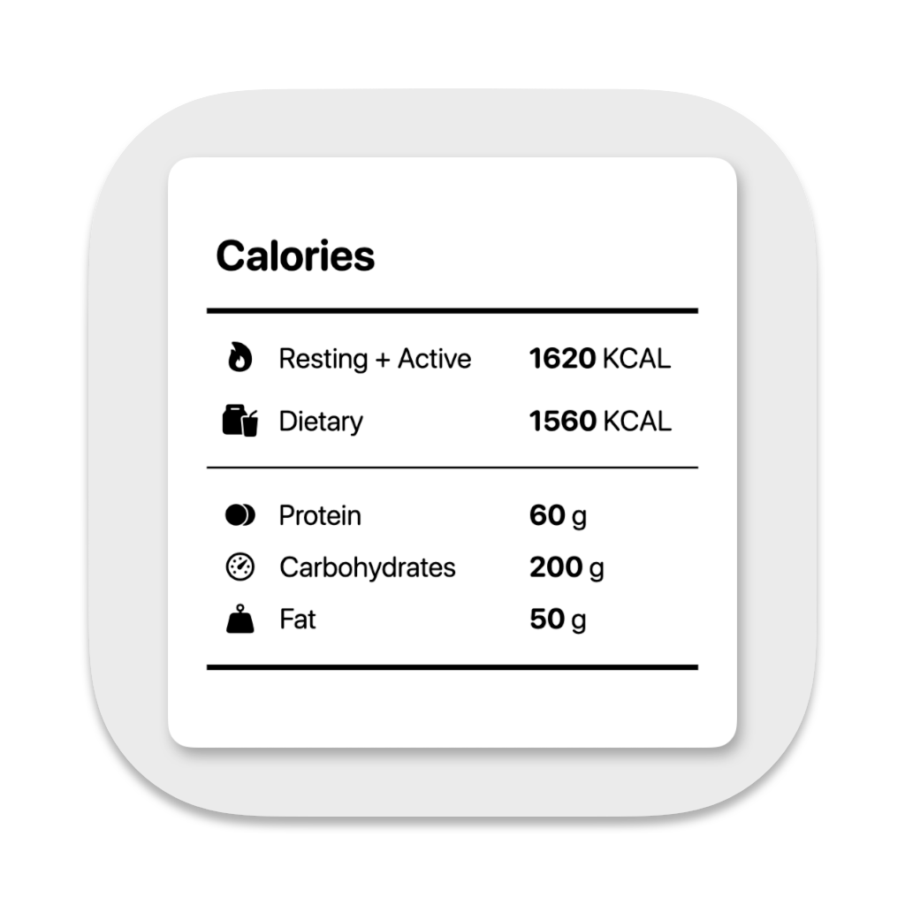
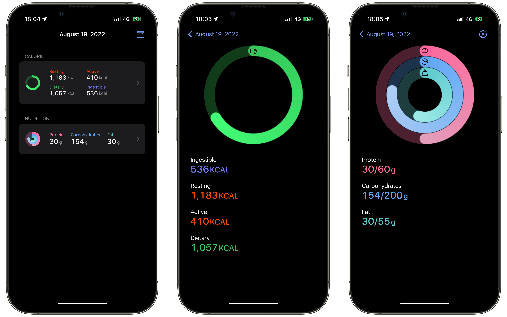

# Calories

    

**Calories** allows you to see your energy balance and nutrition intake in the widget.
You can check if you have taken too much energy or nutrition from food.

## Widgets

Calories provides home screen and lock screen widgets.

## Requirements

- Xcode 15.0+
- macOS 14.0+
- iOS 17.0+
